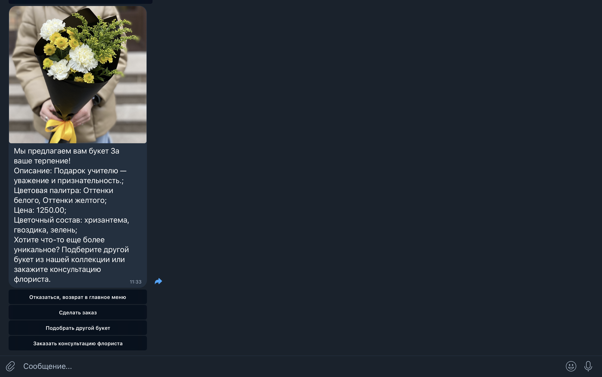
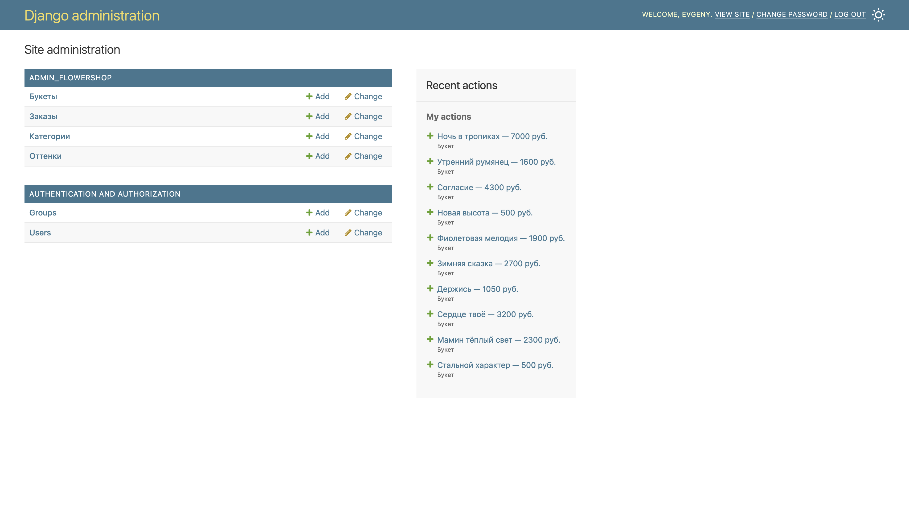
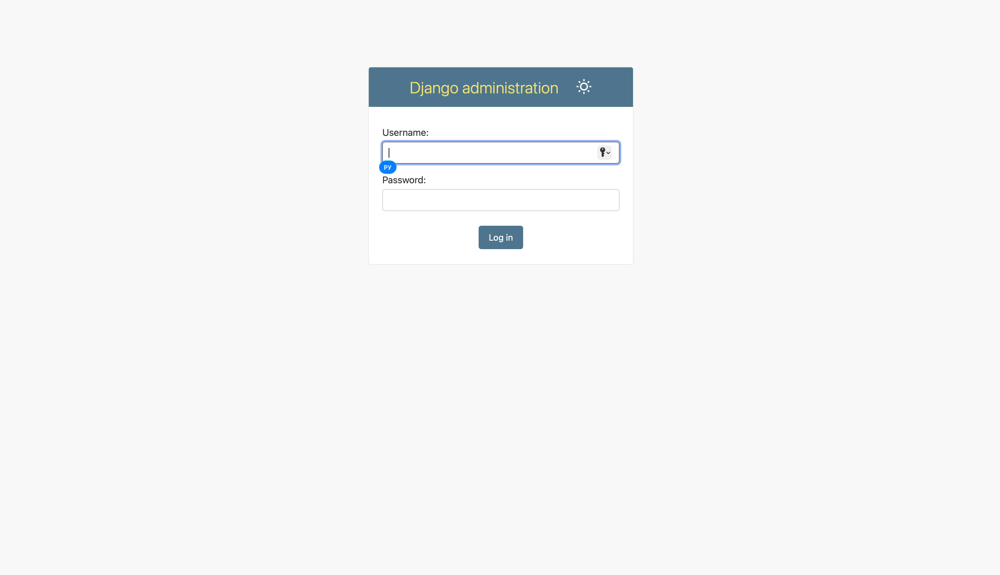

# FlowerShop — чат-бот для продажи букетов
Проект представляет собой Telegram-бот для оформления заказов на букеты.



## Функциональность бота
Пользователи могут выбрать повод, оттенок цветов и желаемую стоимость,
бот показывает букет подходящий под критерии и оформляет заказ.
Так же предусмотренна возможность связаться с флористом для более уникального результата. 
Для удобства просмотра заказов предусмотренна админка Django.
* Выбор параметров букета:
    * Бот предлагает выбрать повод, оттенок цветов и желаемую стоимость букета, затем бот предлагает букет подходящий под критерии.
* Оформление заказа — пользователь оставляет контактные данные, дату и время доставки, которые сохраняются в базе данных, формируется заказ клиента;
* Все данные по заказу клиента направляется курьеру, для последующей доставки;
* У пользователя есть возможность заказать звонок флориста, для подбора уникального букета;
* Админ-панель Django — администратор может добавлять новые букеты, редактировать опции и смотреть заказы;
* Статистика заказов — хранение и просмотр данных о клиентах.

Django панель:




## Как установить
Убедитесь, что установлен [Python 3.13](https://www.python.org/downloads/release/python-3130/).

Для изоляции проекта рекомендуется использовать `.venv` виртуальное окружение:
```shell
python -m venv .venv
```

Активируйте виртуальное окружение:
**Windows**
```shell
.venv\Scripts\activate
```
**Linux/macOS**
```shell
source .venv/bin/activate
```

Затем используйте `pip` для установки зависимостей:
```shell
pip install -r requirements.txt
```

Для запуска и администрирования базы данных, используйте следующие команды:
```shell
python manage.py makemigrations
python manage.py migrate
python manage.py createsuperuser
python manage.py runserver
```
Команды `makemigrations` и `migrate` применяют миграции к базе данных.
Команда `createsuperuser` создает администратора для работы с приложением `django admin`.
При вводе команды, вам будет предложено создать логин и пароль,
для дальнейшей работы в приложении администрирования.



Команда `runserver` запускает локальный сервер, перейдя по ссылке на который,
вы сможете попасть на административную страничку `django`, при первом запуске вам необходимо
ввести логин и пароль, затем можно приступать к работе.

Для запуска бота:
```shell
python bot/bot.py
```
С этого момента бот находится в работе и реагирует на сообщения пользователя. 
Для остановки бота нажмите Ctrl+C.

## Переменные окружения
Для работы с переменными окружения переименуйте файл `.env.example` в`.env`.

В файле находятся следующие переменные:
* `DJANGO_SECRET_KEY=` - секретный ключ проекта, необходимо указать;
* `TG_TOKEN=` - токен телеграмм бота, необходимо указать;
* `DEBUG=` - режим разработки, необходимо удалить переменную, если не хотите участвовать в разработке (по умолчанию значение `False`);
* `ALLOWED_HOSTS=` - url адрес хоста для django админки, необходимо удалить переменную, если хотите использовать стандартные настройки (локальный хост);
* `POLICY_URL=` - ссылка на пользовательское соглашение, необходимо указать;
* `FLORIST_CHAT_ID=` - чат id телеграмм вашего флориста (канал, группа, пользователь), необходимо указать;
* `COURIER_CHAT_ID=` - чат id телеграмм вашего курьера (канал, группа, пользователь), необходимо указать.

`DJANGO_SECRET_KEY` Можно сгенерировать при помощи команды:
```shell
python -c "from django.core.management.utils import get_random_secret_key;
 print(get_random_secret_key())"
```
Скопируйте и вставьте выданный ключ в файл `.env`.

Ознакомиться с туториалом о том, как зарегистрировать и получить токен бота,
а так же о том, как создать группу или канал в телеграм 
можно по ссылке [Отложенный постинг](https://smmplanner.com/blog/otlozhennyj-posting-v-telegram/).
Обратите внимание, `FLORIST_CHAT_ID=` и `COURIER_CHAT_ID=`, если это тг - каналы, должны иметь вид `@name_group`.


